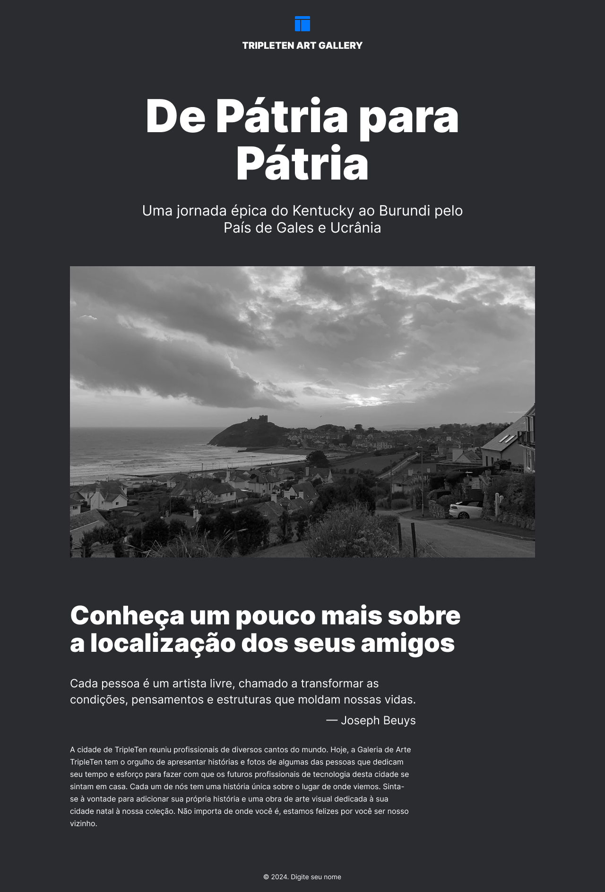

# 🌍 **Tripleten Web Project Homeland** ✈️ 🏡

Bem-vindo(a) ao **Tripleten Web Project Homeland**! Este projeto é uma página web com design adaptável (responsivo) que apresenta as cidades natais de alguns colaboradores da Triple Ten, em um layout moderno e dinâmico. 🎇

## 🚀 **Tecnologias Utilizadas**
- **HTML** e **CSS** para estruturação e estilização da página.

## 👩‍💻 **Autor**
- Criado por mim, **Raíme Gomes**, este projeto foi desenvolvido com base em um design exclusivo fornecido pela plataforma **Figma**, de autoria da Triple Ten Bootcamp.

## 🌐 **Acesse o Projeto**
- Veja o projeto [aqui](https://raimegomes.github.io/web_project_homeland/).

## 📸 **Prévia do Projeto**
Abaixo está uma prévia visual de como o projeto se apresenta:

## 📬 **Contato**
- **LinkedIn**: [Raíme Gomes](https://www.linkedin.com/in/raimeamador/)
- **E-mail**: raime.gomes.dev@gmail.com

Aproveite a navegação e sinta-se à vontade para explorar as histórias por trás das cidades natais! 😊

